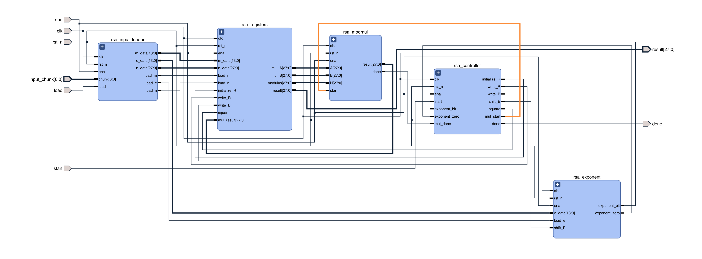
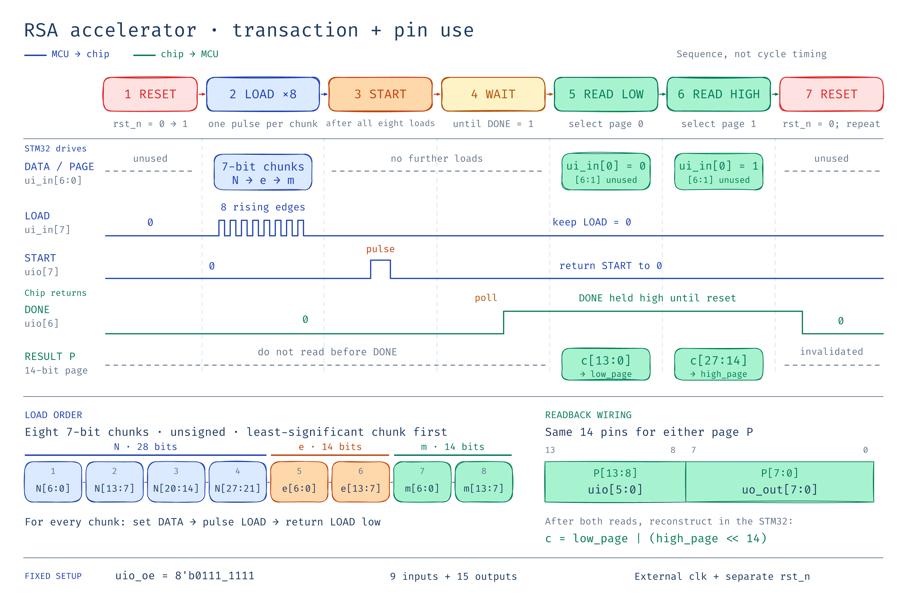

# RSA Encryptor Proposal

**Team:** Yaron Jing and Derek

## 1. Statement of purpose

We will build an 28-bit RSA accelerator computing `c = m^e mod N`. An STM32 will prepare inputs and verify the ciphertext. This project is an demonstration, not secure real-world encryption.

## 2. System diagram



## 3. IO pin assignment table (Tiny Tapeout pins)

Directions are relative to the chip. `P` denotes the selected 14-bit result page.

| Pin | Direction | Assignment                                                          |
| --- | --- |---------------------------------------------------------------------|
| `ui_in[6:0]` | In | Seven-bit input chunk; Use as page selection after finished loading |
| `ui_in[7]` | In | `LOAD`: one rising edge per chunk                                   |
| `uio[7]` | In | `START`: rising edge after eight loads                              |
| `uio[6]` | Out | `DONE`: result valid until reset                                    |
| `uio[5:0]` | Out | `P[13:8]`                                                           |
| `uo_out[7:0]` | Out | `P[7:0]`                                                            |
| `clk`, `rst_n` | In | External design clock and active-low reset                          |

GPIO use: nine inputs and fifteen outputs, plus separate clock/reset pins. Set `uio_oe = 8'b0111_1111`. RTL `ena` is the internal design-selection enable, not an MCU GPIO; keep the design selected during each transaction.

**Input encoding:** unsigned binary, least-significant chunk first. Reset with `LOAD`/`START` low, then send eight chunks on `ui_in[6:0]`, pulsing `LOAD` once each:

```text
Load:     1         2         3         4         5         6         7         8
Data:   N[6:0]   N[13:7]   N[20:14]  N[27:21]   e[6:0]   e[13:7]    m[6:0]   m[13:7]
```

After loading complete: Keep `LOAD` low, pulse `START`, and wait for `DONE`. Select/read both pages, then compute `c = low_page | (high_page << 14)`. Reset before the next transaction.



### 3.1 Instructions for use

1. **Connect the STM32.** Connect its GPIOs to the input chunk, `LOAD`, `START`, reset, and output signals. Provide the external clock and a common ground. Keep the Tiny Tapeout design selected throughout the transaction.

2. **Reset the chip.** Set `LOAD` and `START` low, assert `rst_n = 0`, then release reset with `rst_n = 1`. Reset clears `DONE` and restarts the input-loading sequence.

3. **Load the inputs.** Send the following eight unsigned 7-bit chunks in order:

   | Load pulse | Data |
         | --- | --- |
   | 1 | `N[6:0]` |
   | 2 | `N[13:7]` |
   | 3 | `N[20:14]` |
   | 4 | `N[27:21]` |
   | 5 | `e[6:0]` |
   | 6 | `e[13:7]` |
   | 7 | `m[6:0]` |
   | 8 | `m[13:7]` |

   For each chunk, set the data while `LOAD` is low, allow it to settle, pulse `LOAD` high, and return it low before sending the next chunk. The STM32 must hold data stable long enough for the chip to capture it.

4. **Start computation.** After the eighth load, keep `LOAD` low and pulse `START` high, then low. Do not load additional inputs during computation.

5. **Wait for completion.** Poll `uio[6]` until `DONE = 1`. Use a firmware timeout to detect a stalled transaction.

6. **Read both result pages.** After completion, `ui_in[0]` becomes `PAGE_SELECT`; keep `LOAD` and `START` low.

   | `PAGE_SELECT` | Selected page `P` |
         | --- | --- |
   | `0` | `c[13:0]` |
   | `1` | `c[27:14]` |

   After each selection, allow the selector to synchronize and outputs to settle. Read the selected page as:

   `P = ((uio[5:0] & 0x3F) << 8) | uo_out[7:0]`

   Reconstruct the ciphertext using unsigned 32-bit arithmetic:

   `c = low_page | (high_page << 14)`

7. **Verify and repeat.** Compare the ciphertext against the software calculation `m^e mod N`. Reset the chip before loading the next transaction.

The output is valid only when `DONE` is high. `DONE` and the completed result remain available until reset.

### RSA mathematics

For RSA encryption, the STM32 chooses two distinct primes $p$ and $q$, then calculates

$$
N = pq, \qquad \varphi(N) = (p-1)(q-1).
$$

It selects a public exponent $e$ satisfying

$$
1 < e < 2^{14}, \qquad \gcd(e,\varphi(N)) = 1,
$$

and computes the private exponent $d$ using the extended Euclidean algorithm:

$$
ed \equiv 1 \pmod{\varphi(N)}.
$$

The public key is $(N,e)$. The STM32 supplies $N$, $e$, and $m$ to the chip, which produces the ciphertext

$$
c = m^e \bmod N.
$$

The STM32 verifies the result by decrypting it in software:

$$
m_{\mathrm{recovered}} = c^d \bmod N.
$$

For valid RSA parameters, $m_{\mathrm{recovered}} = m$. The private exponent $d$ may exceed 14 bits; it remains on the STM32 and is not supplied to the chip.

### Hardware exponentiation algorithm

The chip uses right-to-left binary square-and-multiply. It initializes

$$
R = 1, \qquad B = m, \qquad E = e.
$$

While $E \ne 0$, it performs:

1. If the lowest bit of $E$ is 1, update $R \leftarrow RB \bmod N$.
2. Update $B \leftarrow B^2 \bmod N$.
3. Shift the exponent right: $E \leftarrow \lfloor E/2 \rfloor$.

When $E = 0$, the result register contains $R = m^e \bmod N$. Both multiplication and squaring use the same modular multiplication unit. If the initial exponent is zero, the result remains 1, which equals $1 \bmod N$ because $N > 1$.

### Iterative modular multiplication

To compute $AC \bmod N$, with $0 \le A,C < N$, the multiplication unit initializes

$$
X = A, \qquad Y = C, \qquad P = 0.
$$

While $Y \ne 0$, it performs:

1. If the lowest bit of $Y$ is 1, update $P \leftarrow (P+X) \bmod N$.
2. Update $X \leftarrow 2X \bmod N$.
3. Shift $Y$ right: $Y \leftarrow \lfloor Y/2 \rfloor$.

When $Y = 0$, the accumulator contains $P = AC \bmod N$.

Because $P,X < N$, each addition produces a value $S < 2N$. Reduction therefore requires only one conditional subtraction:

$$
S \bmod N =
\begin{cases}
S-N, & S \ge N,\\
S, & S < N.
\end{cases}
$$

The implementation reuses one **29-bit adder/subtractor**, including an extra bit to prevent overflow when adding two 28-bit values. This avoids a dedicated full-width multiplier and general-purpose divider.


## 4. Proposed specification

| Item         | Proposed specification                                                       |
|--------------|------------------------------------------------------------------------------|
| Function     | `c = m^e mod N`, using square-and-multiply and one shared modular multiplier |
| Widths       | 28-bit `N`, 14-bit `e`, 14-bit `m`, 28-bit `c`                               |
| Valid inputs | `1 < N < 2^28`; `0 <= m < min(N, 2^14)`; `0 <= e < 2^14`                     |
| Edge case    | `e = 0` returns `1 mod N`; no invalid-input error pin                        |
| Clock target | 50 MHz; an unvalidated target                                                |
| Process time | 1000 to 2000 cycle for each output; an unvalidated target                    |

**Verification:** compare against software on known, include `e = 0`.

## 5. Timeline for completion

Proposed October 2026 calendar, targeting a verified design and submission package before November; fabricated hardware arrival is outside this schedule.

| Dates | Milestone |
| --- | --- |
| Oct 1-7 | Finalize widths, pin protocol and CDC plan; implement loader, registers and multiplier |
| Oct 8-14 | Integrate controller/exponent logic; complete unit and end-to-end simulation |
| Oct 15-21 | Run synthesis and GF180 physical flow; check area/timing; build STM32 driver and demo |
| Oct 22-28 | Resolve physical/verification failures; review DRC/LVS results and finalize documentation |
| Oct 29-30 | Joint regression, design review and submission-package freeze |
| Oct 31 | Buffer for final corrections |

## 6. Who does what

Proposed work split:

| Person | Primary responsibilities |
| --- | --- |
| Yaron Jing | Input loader, Tiny Tapeout wrapper/pin interface, STM32 firmware |
| Derek | Modular multiplier, exponent block, controller |
| Both | testing against software calculation, integrate TT chip with STM32, clock-domain crossing testing, clock speed testing, docs |

## 7. References

1. [Tiny Tapeout GPIO interface](https://tinytapeout.com/specs/gpio/) - pin groups and direction conventions.
2. [Tiny Tapeout GF26a repository](https://github.com/TinyTapeout/tinytapeout-gf-26a) - GF180 shuttle and implementation resources.


